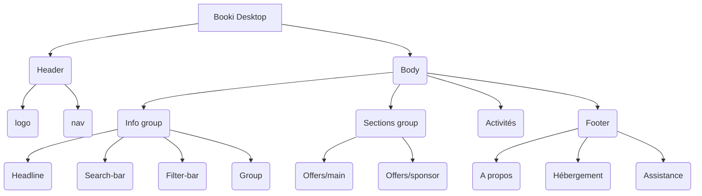

# Projet 1 Formation développeur Web
https://openclassrooms.com/fr/paths/717/projects/1332/assignment
# Mission:

L'entreprise Booki fait appel à moi pour dévelloper l'interface du site internet de l'entreprise en HTML et CSS.
La CTO, Sarah, m'envoie un mail avec la maquette du site  fait par Loîc, l'UI designer, ainso qu'une note de synthèse avec les spécification et contraintes à respecter.

<li>un fichier “index.html” contenant une première base du code HTML que je dois compléter</li>
<li>un dossier “css” contenant un fichier “style.css” avec une première ébauche du code CSS et que je dois compléter également</li>
<li>un dossier “images” contenant l’ensemble des images utilisées sur le site</li>
<li>envoyer le dossier via GitHub</li>

# Booki Desktop Maquette
https://www.figma.com/file/r9YJyUkpVdrxzBBKGH7reY/Maquettes-Booki-(desktop%2C-mobile%2C-tablette)?node-id=3%3A0&t=gyjJFyY7AmGqakUL-0

# Analyse de la maquette et shématisation:

# Résultat du Projet
https://wariwulf.github.io/OpenclassroomsProject/
