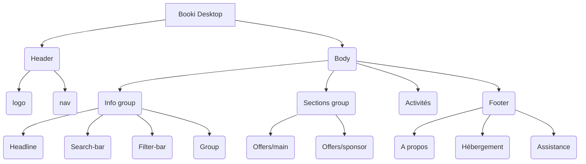

# Projet 1 Formation développeur Web
# Giel Robin
# Booki Desktop

# Analyse de la maquette et shématisation:

```mermaid
    flowchart TD
    A[Booki Desktop] --> B(Header)
    B --> C(logo)
    B --> D(nav)
    A --> E(Body)
    E --> F(Info group)
    F --> G(Headline)
    F --> H(Search-bar)
    F --> I(Filter-bar)
    F --> J(Group)
    E --> K(Sections group)
    K --> L(Offers/main)
    K --> M(Offers/sponsor)
    E --> N(Activités)
    E --> O(Footer)
    O --> P(A propos)
    O --> Q(Hébergement)
    O --> R(Assistance)
```

